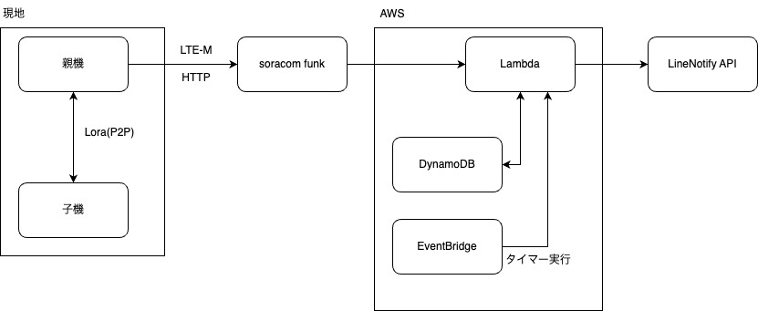

# trap-notify-system
raspberrypiを使用した罠発信システム

## ファイル構成
base 親機  
extension 子機  
server サーバー

## 環境
親機 RaspberryPi-pico  Wio-E5 SIM7080G(M5Stamp)  
子機 RaspberryPi-pico  Wio-E5  
server AWS Lambda DynamoDB


## server設定
サーバーはAWSを利用します. 
### AWS Lambda
サーバー機能のプログラムを実行します. Python3.9で作動します. <u>Python3.9未満では動作しません. </u>
受け取るJSONファイルによって実行される処理が決まります.  
```
wdc -> ウォッチドッグ確認 {"dt": "wdc"}  
wdr -> ウォッチドック受信 {"dt": "wdr", "IMSI":"imsiNumbe"}  
wdu -> 起動通信(timestampのみ更新) {"dt": "wdu", "IMSI":"imsiNumber"}  
alt -> アラート {"dt": "alt", "IMSI":"imsiNumber", "txt":"メッセージ内容"}  
```
IMSI = SIMのimsi番号 送信親機の特定に使用  
txt = 受信するテキストは以下の形式となる.
```
+TEST: LEN:250, RSSI:-106, SNR:10
+TEST: RX 404EA99000800A00089F6E770959
```
LENは子機からのデータの文字数, RSSI,SNRは電波状況
RXは子機から送信されたデータである。16進数となっているがデコードを行うと
```
j314t+{version}/{serial}/
```
versionはバージョンv1など
serialはloraデバイスのシリアルナンバーであり、+で区切っている

sirial_number = RaspberryPIのシリアル番号  発信子機の特定に使用  

DynamoDBに接続する権限設定が必要です

### AWS EventBridge
EventBridgeはLambdaをタイマーで定期実行するために使います. 親機の死活確認に必要です.  
スケジュール式(JST5時に実行する場合): cron(0 20 ? * * *) 

ターゲット入力を設定 を 定数(JSONテキスト) に設定した上で以下のJSONを指定.
```
{
  "dt": "wdc"
}
```

### AWS DynamoDB
実行に必要な変数を保存します.  
テーブルは親機・子機用で２種類必要です. Lambda内に２つのテーブル名を記載してください.
#### フィールド設定
親機は以下の項目で入力を行う
```
id-パーティションキー, LineNotifyApi, name, timeStamp, watchdog(ブール)
```
id = IMSI
LineNotifyApi = Line NotifyのAPIを入力  
name = 親機名を入力(日本語は未検証)  
timeStamp = 初期は適当な文字列を入力  
watchdog = ブール式で初期はFalseを入力  

子機は以下の項目で入力を行う
```
id-パーティションキー, name
```
id = RaspberryPIのシリアル番号  
name = 子機名を入力(日本語は未検証)   

## Soracom設定
plan-KM1を使用. KDDI回線  
SIMグループを作成し、該当SIMを全てグループに追加した上でSoracom Funkの設定を行う.

Soracom funk -> AWS Lambdaの認証設定方法  
https://users.soracom.io/ja-jp/docs/funk/aws-lambda/

エントリポイント（HTTP）(親機からsoracomへ送信)
```
http://funk.soracom.io
```